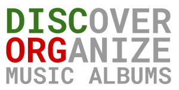

Discorg is an app that helps to discover and organize music albums from different sources and across multiple platforms.

**The problems that I seek to solve**
* organizing music on album-level in Spotify is hard (see also here: http://www.samseely.com/blog/2016/7/10/spotifys-library-organization-problem)
* Spotify has no album collections, no album tagging
  * I cannot filter albums by genre, for example
* Spotify has hard limit on library size
* not everything is on Spotify, I want to be able to connect more music streaming platforms (Bandcamp, personal media streaming via Plex or similar)
* to discover new music I must go through my usual sources of periodically
and manually add and enqueue interesting albums in my Spotify (or other platform) library

The solution to these problems is functionality in these two major categories:

**Discover**
* aggregate sources of new music releases such as rateyourmusic.com, aoty.com, pitchfork.com, www.sputnikmusic.com
* add found albums to library, tag automatically

**Organize**
* organize albums in a music library
* provide collections/tags functionality for albums
* retain information about source of music - how it was discovered
* link to streaming platforms for direct listening

**Library MVP**
* multi-user web app with server-side rendering
* import user's existing Spotify album collection
* store albums by Spotify id
* list albums in library, link to Spotify for listening
* remove album from library

**Tech**
This is as much a tool that I really need as a playground for trying new tech.

* static code analysis
    - [x] phpstan + strict rules
    - [ ] checked exceptions
    - [x] strict coding standard rules
    - [x] deptrac for architecture rules
    - [ ] psalm?
* HTTP stack
    - [x] PSR-7 request/response
    - [x] PSR-15 middleware stack
    * https://github.com/Nyholm/psr7
    * https://github.com/middlewares/awesome-psr15-middlewares
    * https://github.com/middlewares/psr15-middlewares
    * https://github.com/thephpleague/route
* application architecture
    - [x] strictly separated domain, application and infrastructure layers
    - [ ] command bus, query bus?, (async) events
    - [ ] DDD - aggregates, repositories, value objects
* testing
    - [x] end-to-end tests using HTTP request/response
    - [ ] behat/gherkin for acceptance testing of behaviour
    - [ ] proper unit tests (no mocks, no brittle single-class tests)
    - [ ] phpspec?
* infrastructure
    - [ ] CI - GitHub Actions
    - [ ] set up production environment
    - [ ] CD - deploy to production automatically on successful build

